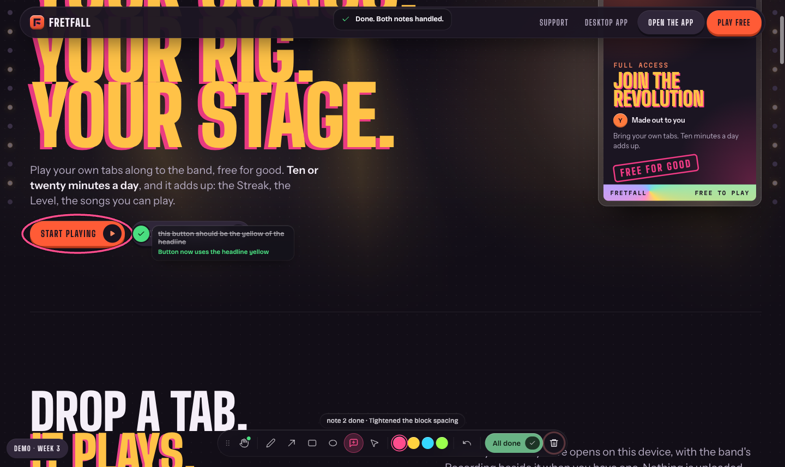

# claude-annotate

Draw on your running localhost site, drop sticky notes, hit **Send to Claude**.
The marks, the notes, the element under each one and the screenshots land in the
Claude Code session that opened the page. Claude fixes the code and the progress
shows up on the page, note by note.

```
/annotate http://localhost:5180/
```

That opens the page in its own Chrome window with the tools already on it.

<p></p>

## What you get

- **Marks**: pen, arrow, box, circle, in four inks that read on any background.
- **Notes**: numbered pins with a short text. Click a pin to edit or delete.
- **Everything stays put** while you scroll, and across pages: annotate the
  landing page, click through to pricing, annotate there, send once.
- **Browse mode** (`V` or `esc`) lets you click the page normally.
- **Send to Claude** pushes one batch into the session. Each note arrives with
  the text you wrote, the element under the pin (selector, visible text, React
  component chain and source file when the app exposes it), the marks around it,
  and a cropped screenshot of that area plus a full-page overview.
- **Progress on the page**: a pin spins while Claude works on that note, turns
  green with Claude's one-line result when done, grey if skipped. The toolbar
  shows what Claude is editing. Claude can also toast a question at you.
- **Clear** wipes every page and the temporary screenshots. Two clicks, no dialog.
- Screenshots live in the system temp dir for the length of one batch and are
  deleted when Claude calls done, on Clear, and when the session ends.

Everything runs on your machine. Nothing is uploaded anywhere.

## Install

Requirements: Claude Code, Node 20+, Google Chrome (or Edge: set
`ANNOTATE_BROWSER=msedge`). No Playwright browser download is needed, the plugin
drives the Chrome you already have, in a separate profile.

Inside Claude Code:

```
/plugin marketplace add /path/to/claude-annotate
/plugin install annotate@claude-annotate
```

Then start Claude Code with the channel enabled, so the page can push into the
session:

```
claude --dangerously-load-development-channels plugin:annotate@claude-annotate
```

Channels are a research preview in Claude Code and third-party channel plugins
need that flag for now. Alias it. If you're on a Team or Enterprise plan an
admin has to enable channels for the org, otherwise use poll mode below.

## Use

```
/annotate http://localhost:5180/
```

Draw, add notes, scroll, change pages, then **Send to Claude**. Watch the pins.
When Claude calls done, the toolbar says **All done** and Clear lights up.

Shortcuts: `P` pen · `A` arrow · `R` box · `E` circle · `N` note · `S` select ·
`1`–`4` inks · `V`/`esc` browse · `⌘Z` undo · `⇧⌘Z` redo · `⌫` delete selection ·
`⌘↵` send. Hold `⇧` while drawing a box or circle to keep it square. Drag the
toolbar by its grip; it remembers where you put it.

Other forms:

- `/annotate pull` if you hit Send and nothing happened in the session.
- `/annotate <url> --poll` if channels are blocked for you. Claude then waits in
  a tool call until you hit Send. Works without the channel flag.
- `/annotate clear`, `/annotate close`.

## How it works

One Node process per session, spawned by Claude Code as an MCP server:

1. It launches Chrome through `playwright-core` with a dedicated profile and
   injects `server/overlay.js` into every page before the page's own scripts
   run. The overlay is a Shadow DOM on top of the document, so the page's CSS and
   ours never meet. All coordinates are document coordinates, so marks stay put
   while scrolling.
2. The overlay talks to the process over a local HTTP port, authenticated with a
   per-session token. State is kept per URL on the server, so navigating keeps
   your marks and re-opening a page restores them.
3. On Send, the process screenshots each annotated page (pages that aren't open
   get rendered in a hidden tab), clusters nearby marks into crops, writes the
   PNGs to a temp dir, and pushes one event into the Claude Code session through
   the channel capability (`notifications/claude/channel`).
4. Claude reads the PNGs, edits the code, and calls `annotate_progress` and
   `annotate_done`. Those fan out to the page over server-sent events. A
   `PostToolUse` hook also reports which file Claude just edited.

Tools the server exposes: `annotate_open`, `annotate_progress`, `annotate_done`,
`annotate_reply`, `annotate_screenshot`, `annotate_pull`, `annotate_wait`,
`annotate_clear`, `annotate_close`.

## Environment

| Variable | Effect |
|---|---|
| `ANNOTATE_BROWSER` | `chrome` (default), `msedge`, or `chromium` (needs `npx playwright install chromium`) |
| `ANNOTATE_PORT` | Pin the bridge port; default is ephemeral, one per session |
| `ANNOTATE_DEBUG=1` | Adds an `annotate_debug` tool that drives the browser (mouse, keys, eval). Development only |

## Development

```
cd plugin && npm install
claude --plugin-dir ./plugin --dangerously-load-development-channels plugin:annotate@claude-annotate
```

The Chrome profile lives in `~/.cache/claude-annotate/chrome-profile`. When two
sessions run at once the second one gets a throwaway profile. Session endpoint
files for the hook are in `~/.cache/claude-annotate/sessions/`.

## License

MIT
